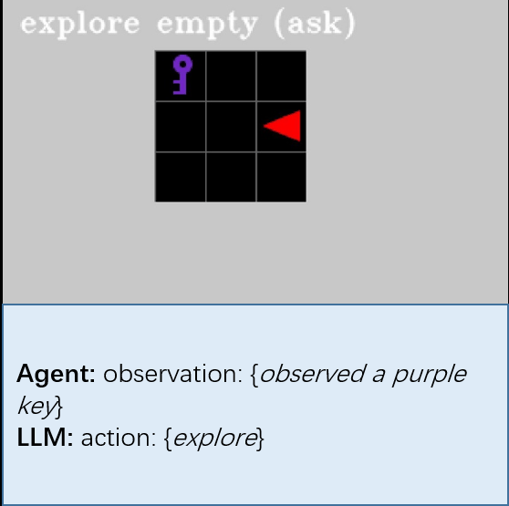

# [Enabling Intelligent Interactions between an Agent and an LLM: A Reinforcement Learning Approach](https://arxiv.org/pdf/2306.03604.pdf)
## Abstract
Large language models (LLMs) encode a vast amount of world knowledge acquired from massive text datasets. Recent studies have demonstrated that LLMs can assist an algorithm agent in solving complex sequential decision making tasks in embodied environments by providing high-level instructions. However, interacting with LLMs can be time-consuming, as in many practical scenarios, they require a significant amount of storage space that can only be deployed on remote cloud server nodes. Additionally, using commercial LLMs can be costly since they may charge based on usage frequency. In this paper, we explore how to enable efficient and cost-effective interactions between the agent and an LLM. We propose a reinforcement learning based mediator model that determines when it is necessary to consult LLMs for high-level instructions to accomplish a target task. Experiments on 4 MiniGrid environments that entail planning sub-goals demonstrate that our method can learn to solve target tasks with only a few necessary interactions with an LLM, significantly reducing interaction costs in testing environments, compared with baseline methods. Experimental results also suggest that by learning a mediator model to interact with the LLM, the agent's performance becomes more robust against both exploratory and stochastic environments. 


## Purpose
This repo is intended to serve as a foundation with which you can reproduce the results of the experiments detailed in our paper, [Enabling Efficient Interaction between an Algorithm Agent and LLMs: A Reinforcement Learning Approach](https://arxiv.org/pdf/2306.03604.pdf)

## How you run the LLM
For the LLM's deployment, refer to instructions in its github codes. 

Here is an example of how to run Vicuna models in linux terminals:
1. Download necessary files and model weights from https://github.com/lm-sys/FastChat
2. Follow the commands  provided to launch the API in separate terminals (such as tmux):
python3 -m fastchat.serve.controller --host localhost --port <controller_port>        ### Launch the controller
python3 -m fastchat.serve.model_worker --model-name '<model_name>' --model-path <Vicuna_path> --controller http://localhost:<controller_port> --port <model_port> --worker_address http://localhost:<model_port>        ### Launch the model worker
python3 -m fastchat.serve.api --host <API_host> --port <API_port>        ### Launch the API
3.  In planner.py, set url to 'http://API_host:API_port/v1/chat/completions

## Running experiments

### Basics
Any algorithm can be run from the main.py entry point.

to train on a SimpleDoorKey environment,

```bash
python main.py train --task SimpleDoorKey --save_name experiment01 
```

to eval the trained model "experiment01" on a SimpleDoorKey environment,

```bash
python main.py eval --task SimpleDoorKey --save_name experiment01 --show --record
```

to run other baseline,

```bash
python main.py baseline --task SimpleDoorKey --save_name baseline
python main.py random --task SimpleDoorKey --save_name random
python main.py always --task SimpleDoorKey --save_name always
```

to train and eval RL_case,
```bash
python main.py train_RL --task SimpleDoorKey --save_name RL
python main.py eval_RL --task SimpleDoorKey --save_name RL
```

## Logging details 
Tensorboard logging is enabled by default for all algorithms. The logger expects that you supply an argument named ```logdir```, containing the root directory you want to store your logfiles

The resulting directory tree would look something like this:
```
log/                         # directory with all of the saved models and tensorboard 
└── ppo                                 # algorithm name
    └── simpledoorkey                   # environment name
        └── save_name                   # unique save name 
            ├── acmodel.pt              # actor and critic network for algo
            ├── events.out.tfevents     # tensorboard binary file
            └── config.json             # readable hyperparameters for this run
```

Using tensorboard makes it easy to compare experiments and resume training later on.

To see live training progress

Run ```$ tensorboard --logdir=log``` then navigate to ```http://localhost:6006/``` in your browser

## Environments:
* `SimpleDoorKey` : The task of the agent is open the door in the maze with key
* `KeyInBox` : The task of the agent is to toggle the door in the maze. Key is hidden is a box.
* `RandomBoxKey` : The task of the agent is to toggle the door in the maze. The key is randomly put on the floor or in a box
* `ColoredDoorKey` : The task of the agent is to toggle the door in the maze. The room contains multiple keys and only one exit door. The door can be unlocked only with the key of the same color.

## Algorithms:
#### Currently implemented:
* [PPO](https://arxiv.org/abs/1707.06347), VPG with ratio objective and with log likelihood objective
* [Vicuna-7B-v1.1](https://huggingface.co/lmsys/vicuna-7b-v1.1), this is the LLM model we used in our experiment

## Demonstrations:
#### Our approach:


#### Hard-code baseline:


#### Always baseline:


## Citation
If you find [our work](https://arxiv.org/abs/2306.03604) useful, please kindly cite: 
```bibtex
@article{Hu2023enabling,
  title   = {Enabling Intelligent Interactions between an Agent and an LLM: A Reinforcement Learning Approach},
  author  = {Hu, Bin and Zhao, Chenyang and Zhang, Pu and Zhou, Zihao and Yang, Yuanhang and Xu, Zenglin and Liu, Bin},
  journal = {arXiv preprint arXiv:2306.03604},
  year    = {2023}
}
```


## Acknowledgements
This work is supported by Exploratory Research Project (No.2022RC0AN02) of Zhejiang Lab.
