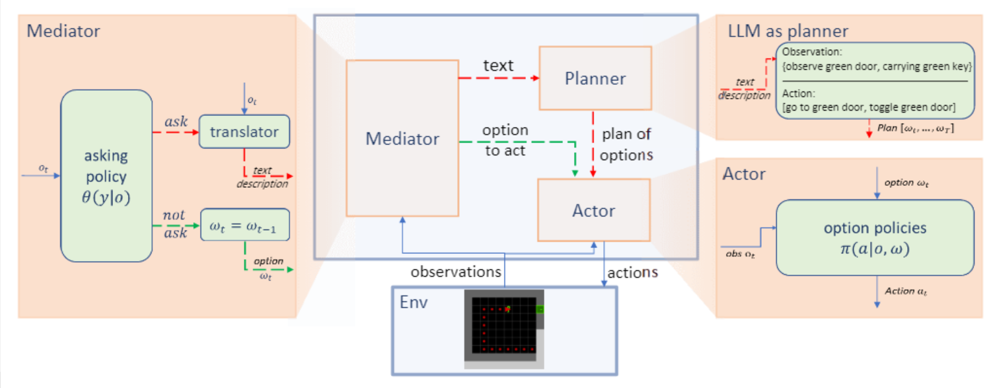

## LLM4RL for Minigrid
LLM4RL is a small, modular library for study the problem of the Large Language Model(LLM) planning in Minigrid.



## Purpose
This repo is intended to serve as a foundation with which you can reproduce the results of the experiments detailed in our paper, "Enabling Efficient Interaction between an Algorithm Agent and LLMs: A Reinforcement Learning Approach."


## Running experiments

### Basics
Any algorithm can be run from the main.py entry point.

to train on a SimpleDoorKey environment,

```bash
python main.py train --task SimpleDoorKey --save_name experiment01 
```

to eval the trained model "experiment01" on a SimpleDoorKey environment,

```bash
python main.py eval --task SimpleDoorKey --save_name experiment01 
```

to run other baseline,

```bash
python main.py baseline --task SimpleDoorKey --save_name baseline
python main.py random --task SimpleDoorKey --save_name random
python main.py always --task SimpleDoorKey --save_name always
```

to train and eval RL_case,
```bash
python main.py train_RL --task SimpleDoorKey --save_name RL
python main.py eval_RL --task SimpleDoorKey --save_name RL
```

## Logging details 
Tensorboard logging is enabled by default for all algorithms. The logger expects that you supply an argument named ```logdir```, containing the root directory you want to store your logfiles

The resulting directory tree would look something like this:
```
log/                         # directory with all of the saved models and tensorboard 
└── ppo                                 # algorithm name
    └── simpledoorkey                   # environment name
        └── save_name                   # unique save name 
            ├── acmodel.pt              # actor and critic network for algo
            ├── events.out.tfevents     # tensorboard binary file
            └── config.json             # readable hyperparameters for this run
```

Using tensorboard makes it easy to compare experiments and resume training later on.

To see live training progress

Run ```$ tensorboard --logdir=log``` then navigate to ```http://localhost:6006/``` in your browser

## Environments:
* `SimpleDoorKey` : The task of the agent is open the door in the maze with key
* `KeyInBox` : The task of the agent is to toggle the door in the maze. Key is hidden is a box.
* `RandomBoxKey` : The task of the agent is to toggle the door in the maze. The key is randomly put on the floor or in a box
* `ColoredDoorKey` : The task of the agent is to toggle the door in the maze. The room contains multiple keys and only one exit door. The door can be unlocked only with the key of the same color.

## Algorithms:
#### Currently implemented:
* [PPO](https://arxiv.org/abs/1707.06347), VPG with ratio objective and with log likelihood objective
* [Vicuna-13B](https://lmsys.org/projects/), An Open-Source Chatbot Impressing GPT-4 with 90%* ChatGPT Quality

## Acknowledgements
This work is supported by Exploratory Research Project (No.2022RC0AN02) of Zhejiang Lab.
